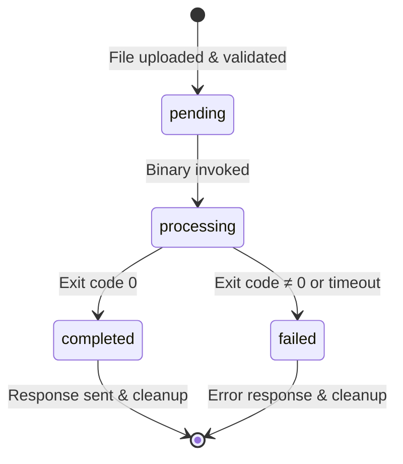

# Data Model: Web Application for Watermark Removal

**Feature**: 001-web-app  
**Date**: 2025-12-25  
**Purpose**: Define entities, their attributes, relationships, and state transitions for the web application

---

## Entity Overview

The web application manages three primary entities during image processing workflows:

1. **Upload Session** - Represents a user's upload request
2. **Processing Job** - Tracks watermark removal operation lifecycle
3. **Image Metadata** - Stores validated image properties

**Note**: This is a **stateless API** with no persistent database. Entities exist only in memory/ephemeral storage during request lifecycle.

---

## 1. Upload Session

### Purpose
Represents a single user upload request, including security validation (Turnstile) and processing context.

### Attributes

| Field | Type | Required | Validation | Description |
|-------|------|----------|------------|-------------|
| `session_id` | UUID | Yes | Auto-generated (UUID v4) | Unique identifier for upload session |
| `client_ip` | IPv4/IPv6 | Yes | Valid IP address | Anonymized IP for rate limiting (last octet masked) |
| `turnstile_token` | String | Yes | Non-empty string (300-500 chars) | Cloudflare Turnstile verification token |
| `turnstile_verified` | Boolean | Yes | Default: false | Whether token passed Cloudflare verification |
| `uploaded_at` | DateTime (ISO 8601) | Yes | Auto-set to current UTC time | Timestamp of upload initiation |
| `uploaded_files` | List[File] | Yes | 1-10 files, each ≤ 10MB | Array of uploaded image files |
| `processing_jobs` | List[ProcessingJob] | Yes | Auto-populated (1 per file) | Associated processing jobs |

### State Transitions

```
[INIT] → upload_received → turnstile_verification_pending
       → turnstile_verified → processing_initiated
       → all_jobs_completed → session_complete
       → cleanup_scheduled (after response sent)
       → [TERMINATED]
```

### Validation Rules

- `session_id`: Must be unique per request
- `client_ip`: Last octet zeroed for privacy (e.g., `192.168.1.0` instead of `192.168.1.123`)
- `turnstile_token`: Must pass Cloudflare API verification before processing begins
- `uploaded_files`: 
  - Each file must have valid MIME type (image/jpeg, image/png, image/webp, image/bmp)
  - Each file size ≤ 10MB
  - Total files per session ≤ 10 (batch limit)

### Relationships

- **1:N** with Processing Job (one session creates multiple jobs for batch uploads)

### Lifespan

- **Creation**: On file upload POST request
- **Destruction**: After response sent + background cleanup task completes (≤ 1 hour max)

---

## 2. Processing Job

### Purpose
Represents the watermark removal operation for a single image file, tracking execution status and results.

### Attributes

| Field | Type | Required | Validation | Description |
|-------|------|----------|------------|-------------|
| `job_id` | UUID | Yes | Auto-generated (UUID v4) | Unique identifier for processing job |
| `session_id` | UUID (FK) | Yes | References Upload Session | Parent session identifier |
| `input_file_path` | Path | Yes | Absolute path to `/tmp/uploads/{uuid}` | Location of uploaded image file |
| `output_file_path` | Path | Yes | Absolute path to `/tmp/outputs/{uuid}` | Location for processed image |
| `status` | Enum | Yes | One of: pending, processing, completed, failed | Current job state |
| `started_at` | DateTime (ISO 8601) | No | Set when status → processing | Processing start timestamp |
| `completed_at` | DateTime (ISO 8601) | No | Set when status → completed/failed | Processing end timestamp |
| `duration_ms` | Integer | No | Calculated (completed_at - started_at) | Processing duration in milliseconds |
| `error_message` | String | No | Max 500 characters | Error details if status = failed |
| `binary_exit_code` | Integer | No | GeminiWatermarkTool exit code | 0 = success, non-zero = error |
| `detected_watermark_size` | Enum | No | One of: small_48x48, large_96x96, unknown | Auto-detected watermark dimensions |

### State Transitions

```
[INIT] → pending → processing → completed → [TERMINATED]
                             ↓
                           failed → [TERMINATED]
```

### Validation Rules

- `status`: Must follow valid state transitions (pending → processing → completed/failed)
- `input_file_path`: File must exist and be readable before processing starts
- `output_file_path`: Parent directory must be writable
- `error_message`: Set only if status = failed
- `duration_ms`: Must be positive integer if set
- `detected_watermark_size`: Set during processing based on image dimensions

### Relationships

- **N:1** with Upload Session (many jobs belong to one session)
- **1:1** with Image Metadata (each job processes one image with metadata)

### Lifespan

- **Creation**: When session file upload is validated
- **Destruction**: After session cleanup (≤ 1 hour post-completion)

---

## 3. Image Metadata

### Purpose
Stores validated properties of uploaded images for logging, monitoring, and watermark size detection.

### Attributes

| Field | Type | Required | Validation | Description |
|-------|------|----------|------------|-------------|
| `job_id` | UUID (FK) | Yes | References Processing Job | Associated processing job |
| `file_name` | String | Yes | Original filename (sanitized) | User-provided filename |
| `file_size_bytes` | Integer | Yes | > 0, ≤ 10MB (10485760 bytes) | File size in bytes |
| `file_format` | Enum | Yes | One of: jpeg, png, webp, bmp | Detected image format (from magic bytes) |
| `mime_type` | String | Yes | Valid MIME (image/jpeg, etc.) | HTTP Content-Type |
| `width_pixels` | Integer | Yes | > 0 | Image width in pixels |
| `height_pixels` | Integer | Yes | > 0 | Image height in pixels |
| `has_watermark` | Boolean | Yes | Default: assumed true | Whether Gemini watermark detected |
| `watermark_size` | Enum | Yes | One of: small_48x48, large_96x96 | Watermark dimensions (auto-detected) |
| `watermark_position` | String | Yes | Fixed: "bottom-right" | Watermark location (Gemini standard) |
| `validation_passed` | Boolean | Yes | Default: false | Whether all validation checks passed |

### Validation Rules

- `file_size_bytes`: Must be ≤ 10MB (10485760 bytes)
- `file_format`: Must match allowed formats (jpeg, png, webp, bmp)
- `width_pixels`, `height_pixels`: Must be > 0
- `watermark_size`: Determined by image dimensions:
  - `small_48x48`: if width ≤ 1024 OR height ≤ 1024
  - `large_96x96`: if width > 1024 AND height > 1024
- `validation_passed`: Set to true only if all checks pass

### Relationships

- **1:1** with Processing Job (one metadata record per job)

### Lifespan

- **Creation**: During file upload validation phase
- **Destruction**: After session cleanup (≤ 1 hour post-completion)

---

## Entity Relationships Diagram

```
┌─────────────────────────────────────┐
│       Upload Session                │
│  ┌───────────────────────────────┐  │
│  │ session_id (PK)               │  │
│  │ client_ip                     │  │
│  │ turnstile_token               │  │
│  │ turnstile_verified            │  │
│  │ uploaded_at                   │  │
│  │ uploaded_files[]              │  │
│  └───────────────────────────────┘  │
└──────────┬──────────────────────────┘
           │ 1:N
           ↓
┌─────────────────────────────────────┐
│       Processing Job                │
│  ┌───────────────────────────────┐  │
│  │ job_id (PK)                   │  │
│  │ session_id (FK)               │  │
│  │ input_file_path               │  │
│  │ output_file_path              │  │
│  │ status                        │  │
│  │ started_at                    │  │
│  │ completed_at                  │  │
│  │ duration_ms                   │  │
│  │ error_message                 │  │
│  │ binary_exit_code              │  │
│  │ detected_watermark_size       │  │
│  └───────────────────────────────┘  │
└──────────┬──────────────────────────┘
           │ 1:1
           ↓
┌─────────────────────────────────────┐
│       Image Metadata                │
│  ┌───────────────────────────────┐  │
│  │ job_id (FK)                   │  │
│  │ file_name                     │  │
│  │ file_size_bytes               │  │
│  │ file_format                   │  │
│  │ mime_type                     │  │
│  │ width_pixels                  │  │
│  │ height_pixels                 │  │
│  │ has_watermark                 │  │
│  │ watermark_size                │  │
│  │ watermark_position            │  │
│  │ validation_passed             │  │
│  └───────────────────────────────┘  │
└─────────────────────────────────────┘
```

---

## State Machine: Processing Job Lifecycle



---

## Pydantic Models (Python Implementation Reference)

### Upload Session

```python
from pydantic import BaseModel, Field, validator
from typing import List
from datetime import datetime
from uuid import UUID, uuid4

class UploadSession(BaseModel):
    session_id: UUID = Field(default_factory=uuid4)
    client_ip: str = Field(..., regex=r"^\d{1,3}\.\d{1,3}\.\d{1,3}\.0$")  # Anonymized
    turnstile_token: str = Field(..., min_length=100, max_length=600)
    turnstile_verified: bool = False
    uploaded_at: datetime = Field(default_factory=datetime.utcnow)
    
    @validator('client_ip')
    def anonymize_ip(cls, v):
        # Ensure last octet is zeroed
        parts = v.split('.')
        parts[-1] = '0'
        return '.'.join(parts)
```

### Processing Job

```python
from enum import Enum

class JobStatus(str, Enum):
    PENDING = "pending"
    PROCESSING = "processing"
    COMPLETED = "completed"
    FAILED = "failed"

class WatermarkSize(str, Enum):
    SMALL_48X48 = "small_48x48"
    LARGE_96X96 = "large_96x96"
    UNKNOWN = "unknown"

class ProcessingJob(BaseModel):
    job_id: UUID = Field(default_factory=uuid4)
    session_id: UUID
    input_file_path: str
    output_file_path: str
    status: JobStatus = JobStatus.PENDING
    started_at: Optional[datetime] = None
    completed_at: Optional[datetime] = None
    duration_ms: Optional[int] = None
    error_message: Optional[str] = Field(None, max_length=500)
    binary_exit_code: Optional[int] = None
    detected_watermark_size: Optional[WatermarkSize] = None
```

### Image Metadata

```python
class ImageFormat(str, Enum):
    JPEG = "jpeg"
    PNG = "png"
    WEBP = "webp"
    BMP = "bmp"

class ImageMetadata(BaseModel):
    job_id: UUID
    file_name: str
    file_size_bytes: int = Field(..., gt=0, le=10485760)  # ≤ 10MB
    file_format: ImageFormat
    mime_type: str
    width_pixels: int = Field(..., gt=0)
    height_pixels: int = Field(..., gt=0)
    has_watermark: bool = True
    watermark_size: WatermarkSize
    watermark_position: str = "bottom-right"
    validation_passed: bool = False
    
    @validator('watermark_size', pre=True, always=True)
    def detect_watermark_size(cls, v, values):
        width = values.get('width_pixels', 0)
        height = values.get('height_pixels', 0)
        
        if width <= 1024 or height <= 1024:
            return WatermarkSize.SMALL_48X48
        else:
            return WatermarkSize.LARGE_96X96
```

---

## Summary

- **3 core entities**: Upload Session, Processing Job, Image Metadata
- **Stateless architecture**: No persistent database; entities exist only during request lifecycle
- **Clear state transitions**: Processing job follows pending → processing → completed/failed
- **Automatic cleanup**: All entities destroyed within 1 hour post-response
- **Type safety**: Pydantic models provide runtime validation and schema generation

This data model supports all user stories (P1-P3) including single image upload, batch processing, and Turnstile validation.
